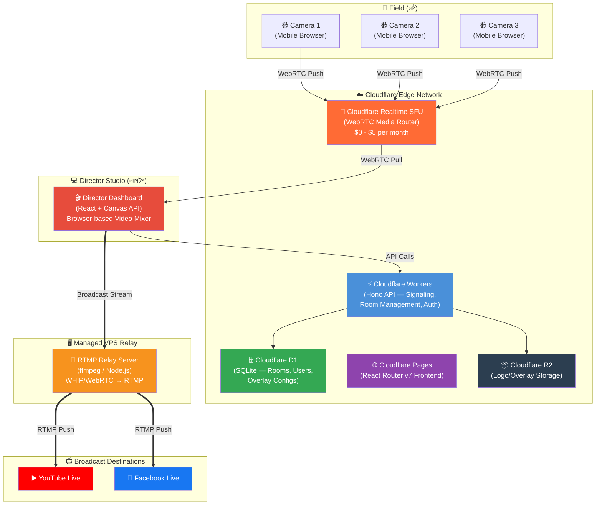

# 🎥 Overlays — Implementation Plan

## Goal
একটি **StreamYard-স্টাইল Web-based Live Streaming Studio** তৈরি করা। মাঠের ক্যামেরাম্যানরা মোবাইল দিয়ে ভিডিও পাঠাবে, ডিরেক্টর ল্যাপটপ থেকে মিক্স করবে এবং একটি **Managed VPS Relay** ব্যবহার করে সরাসরি YouTube/Facebook-এ লাইভ করা হবে।

---

## System Architecture Diagram



---

## Tech Stack (বিস্তারিত)

| Layer | Technology | Details |
|-------|-----------|---------|
| **Frontend Framework** | React Router v7 (Framework Mode) | SSR on Cloudflare Workers, Client-side Canvas Mixer |
| **Backend API** | Hono on Cloudflare Workers | REST API — Room, Auth, Broadcast management |
| **Database** | Cloudflare D1 (SQLite) | Rooms, Users, Overlay configurations |
| **Media Server (SFU)** | Cloudflare Realtime SFU | WebRTC video/audio routing ($0 - $5/month) |
| **Relay Server** | Managed VPS (RTMP Relay) | WebRTC/WHIP → RTMP → YouTube/FB |
| **Asset Storage** | Cloudflare R2 | Logos, overlay images, team badges |
| **Auth** | Hono JWT / Room PIN | Director auth + Camera join via 4-digit PIN |

---

## Monthly Cost Breakdown (মাসিক খরচ)

| Service | Purpose | Estimated Usage | Cost |
|---------|---------|-----------------|------|
| **Cloudflare Workers** | Backend API & Hosting | Required | **~$5.00** |
| **Cloudflare Realtime SFU** | Video Routing | Active usage | **$0 - $5.00** |
| **Managed VPS Relay** | Broadcasting to YT/FB | Managed by Dev | **Included** |
| | | | |
| **Total** (প্রাথমিক) | | | **২০০০ টাকা / মাস (~$18)** |

> [!TIP]
> পুরো সিস্টেমটি ডেভেলপার মেইনটেইন করবেন, ক্লায়েন্টকে শুধু একটি ফিক্সড মাসিক পেমেন্ট করতে হবে। আলাদা কোনো সার্ভার ম্যানেজ করার ঝামেলা নেই।

---

## Project Structure (ফাইল স্ট্রাকচার)

```
live-streaming/
├── app/
│   ├── entry.server.tsx           # Cloudflare Workers entry
│   ├── root.tsx                   # Root layout
│   ├── routes/
│   │   ├── _index.tsx             # 🏠 Landing page 
│   │   ├── studio.$roomId.tsx     # 🎬 Director Studio (Canvas Mixer)
│   │   ├── camera.$roomId.tsx     # 📹 Camera Join page
│   │   ├── dashboard.tsx          # 📊 Room management dashboard
│   │   └── api/                   # API routes (Hono)
│   │       ├── rooms.ts           # Room CRUD
│   │       ├── broadcast.ts       # Start/Stop broadcast
│   │       └── overlays.ts        # Overlay management
│   ├── components/
│   │   ├── VideoMixer.tsx         # Canvas-based video compositor
│   │   ├── CameraGrid.tsx         # Multi-camera preview grid
│   │   ├── SceneSwitcher.tsx      # Scene/camera switch buttons
│   │   ├── OverlayManager.tsx     # Scoreboard & logo overlay controls
│   │   ├── BroadcastControls.tsx  # Go Live / Stop buttons
│   │   └── AudioMixer.tsx         # Audio level controls
│   ├── lib/
│   │   ├── webrtc/
│   │   │   ├── sfu-client.ts      # Cloudflare Realtime SFU client
│   │   │   ├── camera-publisher.ts # Camera track publishing
│   │   │   └── track-subscriber.ts # Track subscription/pulling
│   │   ├── mixer/
│   │   │   ├── canvas-compositor.ts # Canvas API video mixing engine
│   │   │   ├── overlay-renderer.ts  # Overlay/scoreboard drawing
│   │   │   └── stream-output.ts     # captureStream → WHIP output
│   │   ├── cloudflare/
│   │   │   ├── stream-api.ts       # Cloudflare Stream API client
│   │   │   ├── sfu-api.ts          # Cloudflare Realtime SFU API
│   │   │   └── r2-upload.ts        # R2 file upload helper
│   │   └── utils/
│   │       ├── audio-levels.ts     # Audio visualization
│   │       └── device-detect.ts    # Mobile/Desktop detection
│   └── styles/
│       ├── global.css              # Global styles + design system
│       ├── studio.css              # Studio-specific styles
│       └── camera.css              # Camera join page styles
├── migrations/
│   └── 0001_init.sql               # D1 schema (rooms, overlays, users)
├── public/
│   └── assets/                     # Static assets
├── react-router.config.ts          # React Router config
├── vite.config.ts                  # Vite + Cloudflare plugin
├── wrangler.jsonc                  # Cloudflare Workers config
├── tsconfig.json
└── package.json
```

---

## User Review Required

> [!IMPORTANT]
> ### সিদ্ধান্ত নেওয়া দরকার:
> 
> **1. ক্যামেরা জয়েন সিস্টেম:**
> ক্যামেরাম্যানরা কীভাবে রুমে জয়েন করবে?
> - **Option A:** শুধু রুম লিংক (যেমন: `site.com/camera/abc123`) — কোনো লগইন লাগবে না
> - **Option B:** রুম লিংক + PIN কোড (যেমন: ৪ ডিজিটের পিন `1234`)
> - **Option C:** সবার জন্য ফুল লগইন সিস্টেম (ইমেইল/পাসওয়ার্ড)
>
> **2. ওভারলে সিস্টেম:**
> স্কোরবোর্ড কীভাবে আপডেট হবে?
> - **Option A:** ডিরেক্টর নিজে ম্যানুয়ালি স্কোর টাইপ করবে (MVP-এর জন্য সবচেয়ে সহজ)
> - **Option B:** একটি আলাদা ওয়েব URL (iFrame) এম্বেড করা যাবে যেখানে থার্ড-পার্টি স্কোরবোর্ড থাকবে
> - **Option C:** দুটোই (ম্যানুয়াল + URL) — পরে যেকোনোটি ব্যবহার করা যাবে
>
> **3. অথেন্টিকেশন:**
> ডিরেক্টর কীভাবে লগইন করবে?
> - **Option A:** সিম্পল ইমেইল/পাসওয়ার্ড (JWT)
> - **Option B:** Google OAuth (Sign in with Google)
> - **Option C:** শুধু PIN/Passcode (MVP-এর জন্য)

---

## Proposed Changes (কী কী বানাতে হবে)

### Phase 1: Foundation (দিন ১-২)
- প্রজেক্ট সেটআপ (React Router v7 + Cloudflare)
- D1 ডেটাবেস স্কিমা এবং মাইগ্রেশন
- Hono API routes (Room CRUD, Auth)
- গ্লোবাল ডিজাইন সিস্টেম এবং CSS

---

### Phase 2: WebRTC & Camera System (দিন ৩-৪)
#### [NEW] `app/lib/webrtc/sfu-client.ts`
Cloudflare Realtime SFU-এর সাথে WebRTC কানেকশন তৈরি করবে। Session creation, track push/pull হ্যান্ডেল করবে।

#### [NEW] `app/routes/camera.$roomId.tsx`
ক্যামেরাম্যানদের জন্য মোবাইল-ফ্রেন্ডলি পেজ। ক্যামেরা অন করে SFU-তে ভিডিও পাঠাবে।

#### [NEW] `app/components/CameraGrid.tsx`
ডিরেক্টরের স্ক্রিনে ৩টি ক্যামেরা ফিড দেখাবে।

---

### Phase 3: Video Mixer & Overlays (দিন ৫-৬)
#### [NEW] `app/lib/mixer/canvas-compositor.ts`
Canvas API ব্যবহার করে একাধিক ভিডিও স্ট্রিম মিক্স করবে। ওভারলে, লোগো এবং টেক্সট যোগ করবে।

#### [NEW] `app/components/VideoMixer.tsx`
ডিরেক্টরের প্রধান UI। ক্যানভাসে ফাইনাল আউটপুট দেখাবে।

#### [NEW] `app/components/SceneSwitcher.tsx`
ক্যামেরা সুইচ করার বোতাম। Transition effect সহ।

#### [NEW] `app/components/OverlayManager.tsx`
স্কোরবোর্ড, লোগো এবং টেক্সট ওভারলে কন্ট্রোল।

---

### Phase 4: Broadcasting (দিন ৭-৮)
#### [NEW] `app/lib/mixer/stream-output.ts`
`canvas.captureStream()` → MediaRecorder → Cloudflare Stream WHIP endpoint-এ পাঠাবে।

#### [NEW] `app/lib/cloudflare/stream-api.ts`
Cloudflare Stream API client। Live Input তৈরি, RTMP Output (YouTube/FB) কনফিগার করবে।

#### [NEW] `app/components/BroadcastControls.tsx`
"Go Live" / "End Stream" বোতাম। YouTube/Facebook Stream Key ইনপুট।

---

### Phase 5: Polish & Mobile Optimization (দিন ৯-১০)
- মোবাইল ক্যামেরা পেজ অপ্টিমাইজেশন
- ডিরেক্টর UI পলিশ ও অ্যানিমেশন
- এরর হ্যান্ডলিং এবং রিকানেকশন লজিক
- টেস্টিং

---

## Open Questions

> [!NOTE]
> ### আপনার প্রশ্নের উত্তরগুলো:
> 
> **১. ভবিষ্যতে ৩টির বেশি মোবাইল ক্যামেরা কানেক্ট করা যাবে কি?**
> **হ্যাঁ, অবশ্যই যাবে।** Cloudflare SFU-এর আর্কিটেকচারে একসাথে অনেকগুলো মোবাইল কানেক্ট করা যায় (এমনকি ১০-২০টি হলেও সমস্যা নেই)। তবে ডিরেক্টরের ড্যাশবোর্ডে আমরা প্রথমে ৩-৪টি ক্যামেরার গ্রিড ডিজাইন করব। পরবর্তীতে আপনি চাইলে এই সংখ্যা বাড়াতে পারবেন, সিস্টেমটি ডাইনামিক হবে।
> 
> **২. YouTube ফ্রি হলে Cloudflare Stream কেন কিনতে হবে?**
> YouTube বা Facebook শুধুমাত্র **RTMP** সিগন্যাল (ভাষা) বোঝে। কিন্তু আপনার ল্যাপটপের ব্রাউজার (Google Chrome) সরাসরি RTMP সিগন্যাল পাঠাতে পারে না। ব্রাউজার শুধু **WebRTC বা WebM** পাঠাতে পারে। তাই ব্রাউজারের ভিডিওকে YouTube-এর ভাষায় (RTMP) রূপান্তর করার জন্য মাঝখানে একটি **"Translator/Bridge"** দরকার হয়। StreamYard-ও পেছনে তাদের নিজেদের সার্ভারে এই ট্রান্সলেশনের কাজটি করে। 
> Cloudflare Stream হলো আমাদের সেই ট্রান্সলেটর। আপনি ব্রাউজার থেকে Cloudflare-এ ভিডিও পাঠাবেন, আর Cloudflare সেটাকে RTMP বানিয়ে YouTube-এ পাঠিয়ে দেবে।
> 
> **৩. Node.js সার্ভার বা VPS কি আসলেই লাগবে? (বিকল্প কী?)**
> না, **আপনার দুটি একসাথে লাগবে না।** আপনার কাছে দুটি অপশন আছে (যে কোনো একটি বেছে নিতে হবে):
> - **Option A: Cloudflare Stream (Recomended)**
>   এটির কোনো ফিক্সড মাসিক ৫ ডলার সাবস্ক্রিপশন নেই। Cloudflare Stream পে-অ্যাজ-ইউ-গো (Pay-as-you-go)। প্রতি ১০০০ মিনিট (প্রায় ১৬ ঘণ্টা) ব্রডকাস্টের জন্য তারা $1 চার্জ করে। আপনি যদি মাসে ২০টি ম্যাচ (প্রতিটি ২ ঘণ্টা = ৪০ ঘণ্টা) লাইভ করেন, তবে খরচ হবে মাত্র $2.5 - $3 (প্রায় ৩০০-৪০০ টাকা)। এখানে কোনো সার্ভার ম্যানেজ করার প্যারা নেই।
> - **Option B: Own VPS (Node.js + FFmpeg)**
>   যদি Cloudflare Stream ব্যবহার করতে না চান, তবে একটি $4-$5 (৫০০ টাকা) দামের রেন্টাল সার্ভার (VPS - যেমন Hetzner) নিতে হবে। সেখানে আমরা একটি Node.js স্ক্রিপ্ট বসিয়ে দেব যা ট্রান্সলেটরের কাজ করবে। এটি ফিক্সড খরচ, আপনি মাসে যতো খুশি লাইভ করতে পারবেন। তবে সার্ভার সেটআপ এবং মেইনটেন্যান্সের একটু ঝামেলা থাকে। 
> 
> আমাদের প্রধান প্ল্যান হলো **Option A (Cloudflare Stream)** ব্যবহার করা, কারণ এটি সবচেয়ে সস্তা এবং 100% সার্ভারলেস।
> 
> **প্রজেক্টের নাম কী হবে?**
> যেমন: "LiveKhela", "GoLive Studio", "StreamBD" ইত্যাদি।

---

## Verification Plan

### Automated Tests
```bash
npm test                           # Vitest unit tests
npm run type-check                 # TypeScript type checking
```

### Manual Verification
1. **Camera Join Test:** মোবাইল থেকে ক্যামেরা জয়েন করে ভিডিও পাঠানো
2. **Director Studio Test:** ল্যাপটপে ৩টি ক্যামেরা ফিড দেখা
3. **Camera Switch Test:** সিন চেঞ্জ বোতামে ক্লিক করে ক্যামেরা সুইচ
4. **Overlay Test:** স্কোরবোর্ড এবং লোগো ওভারলে যোগ করা
5. **Broadcast Test:** YouTube/Facebook-এ সরাসরি লাইভ স্ট্রিম
6. **Mobile Test:** মোবাইল ব্রাউজারে ক্যামেরা পেজ টেস্ট
